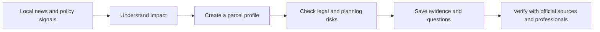

<div align="center">

# Ninh Hòa Invest AI

### V34 · Legal Policy Intelligence Edition

**Android real-estate intelligence for Ninh Hòa, Khánh Hòa — designed in plain Vietnamese for non-technical users.**

[](https://github.com/Megatavn/NinhHoaInvestAI/actions/workflows/build-apk.yml)
[](https://github.com/Megatavn/NinhHoaInvestAI/releases/latest)


[**Download the latest APK**](https://github.com/Megatavn/NinhHoaInvestAI/releases/latest) · [View build history](https://github.com/Megatavn/NinhHoaInvestAI/actions) · [Read the V34 release notes](https://github.com/Megatavn/NinhHoaInvestAI/releases/tag/V34)

<sub>Product author: <strong>Vũ Hoàng</strong></sub>

</div>

---

## Product in 30 seconds

**Ninh Hòa Invest AI** helps families and small investors organize the messy early stage of researching land in Ninh Hòa. It brings local news signals, preliminary parcel checks, legal reminders, area profiles and personal notes into one mobile-first Android experience.

The app is intentionally built for people who are not comfortable with complex property software:

- Vietnamese-first copy with short, practical explanations;
- large touch targets and a clear five-item navigation;
- no account, backend, paid API or sensitive Android permission;
- offline access to core legal-policy learning content;
- explicit separation between confirmed law, implementation roadmaps and research-stage policy.

> The app supports information screening and learning. It does not make a buy/sell recommendation and does not replace official verification or professional legal advice.

---

## Product gallery

<p align="center">
  
  
  
</p>

<p align="center">
  
  
  
</p>

---

## V34 spotlight — Legal Policy Intelligence

V34 adds a dedicated **Chính sách BĐS mới** module that translates major real-estate policy changes into plain Vietnamese. Every topic follows the same decision-friendly structure: what it means, who may be affected, why it matters, what to verify next and the current legal status.

| Status shown in the app | What it means |
|---|---|
| **Đã có hiệu lực** | A legal basis is in force; the exact application still depends on the case. |
| **Theo lộ trình** | The legal framework exists, while implementation or data rollout is continuing. |
| **Đang nghiên cứu** | A proposal or policy direction — not an obligation already applied nationwide. |
| **Cần kiểm chứng nguồn địa phương** | Users must check current Khánh Hòa and Ninh Hòa instruments. |

### Topics covered

- the removal of the national land-price framework and the newer local land-price-table mechanism;
- tighter conditions around project land subdivision and the distinction from household parcel splitting;
- transaction-price transparency and the risk of two-price contracts;
- research-stage policy on second-property or unused-property taxation;
- housing and real-estate market information databases;
- holding cost as a combined financial risk, not a made-up universal tax.

### Interactive policy-pressure check

Users select their role, number of properties, cash-flow status, debt level and investment goal. The app returns:

- a 0–100 screening score;
- a plain-language pressure level;
- three main warnings;
- three practical next checks;
- a **Save to Notebook** action backed by LocalStorage.

This score measures exposure to policy-sensitive investment behaviour. It is not a tax calculation or legal conclusion.

---

## Core experience

| Module | User value |
|---|---|
| **Focused news intelligence** | Prioritizes Ninh Hòa, Vân Phong, planning, infrastructure and legal signals by freshness, impact and source quality. |
| **News impact analysis** | Explains why a story matters, affected areas, risks to verify and the next useful action. |
| **Land check assistant** | Creates a preliminary checklist-style score for legal, planning, access, liquidity and price risks. |
| **Parcel & coordinate assistant** | Records parcel details, map-sheet information, coordinates and estimated area differences. |
| **Area profiles** | Groups signals and saved opportunities around Ninh Diêm, Dốc Lết, Ninh Xuân, Ninh An, Vân Phong and central Ninh Hòa. |
| **Investment notebook** | Stores parcels, news, areas, policy reports and personal notes locally on the device. |
| **Knowledge hub** | Saves useful articles, videos and learning material about property, business, legal checks and negotiation. |

---

## A safer decision flow



The product deliberately stops before the final transaction decision. Its job is to help users ask better questions before visiting land, paying a deposit, changing land use or declaring tax.

---

## Privacy by design

- No sign-in or cloud account.
- No backend database.
- No paid API.
- No location permission.
- No sensitive Android permission.
- Personal notebook data stays in browser LocalStorage on the device.
- Core policy-learning content remains available offline.

External links open official or public sources only when the user chooses to open them.

---

## Architecture

```text
Android Activity
└── Android WebView
    ├── app/src/main/assets/app.html
    │   ├── Mobile-first HTML/CSS interface
    │   ├── News, parcel and policy logic
    │   └── LocalStorage notebook
    └── Android bridge
        ├── Open external sources
        └── Lightweight network fetch for public content
```

| Layer | Technology |
|---|---|
| Android shell | Java, Android WebView |
| Product UI | HTML, CSS, vanilla JavaScript |
| Local persistence | LocalStorage |
| Build | Gradle 8.10.2, JDK 17, Android SDK 35 |
| CI/CD | GitHub Actions |

No additional runtime dependency was introduced for V34.

---

## Build and install

### Download a ready-to-install APK

Open [**Releases**](https://github.com/Megatavn/NinhHoaInvestAI/releases/latest), expand **Assets** and download the V34 APK.

### Build with GitHub Actions

1. Open the repository's [Actions](https://github.com/Megatavn/NinhHoaInvestAI/actions) page.
2. Select **Build APK**.
3. Choose **Run workflow**, or push a change to `main`.
4. Download `NinhHoaInvestAI-v34-legal-policy-intelligence-apk` from the completed run.

### Build locally

Requirements: JDK 17+, Android SDK 35 and Gradle.

```bash
gradle --no-daemon assembleDebug
```

Debug APK output:

```text
app/build/outputs/apk/debug/
```

---

## Repository map

```text
.
├── .github/workflows/build-apk.yml   # Reproducible APK build
├── app/
│   ├── build.gradle                  # Android version and SDK config
│   └── src/main/
│       ├── AndroidManifest.xml
│       ├── assets/app.html           # Main product experience
│       └── java/.../MainActivity.java
├── screenshots/                      # Portfolio gallery
├── build.gradle
├── settings.gradle
└── README.md
```

---

## Legal and product guardrails

Ninh Hòa Invest AI is an educational information-screening and personal note-taking tool.

Before buying, selling, paying a deposit, changing land use or declaring tax, users should verify the latest official instrument and consult the relevant land-registration office, tax authority, notary, lawyer or other qualified professional.

**This app is not legal advice, valuation advice or investment advice.** Scores and explanations are not official conclusions.

---

## Portfolio summary

> Added a legal policy intelligence module that explains real estate regulation changes in plain Vietnamese, separates confirmed law from draft/research-stage policy, and helps users estimate policy pressure for speculation-heavy investment behavior.

This project demonstrates product discovery, Vietnamese UX writing, mobile information architecture, risk-aware LegalTech communication, offline-first state management, Android WebView engineering and automated APK delivery.

---

## Release history

- **V34 — Legal Policy Intelligence Edition:** policy-status system, six policy explainers, audience filters, before/after comparison, pressure scoring and notebook persistence.
- **V32.1 — News Logic Critical Fix:** stronger handling of high-impact regional infrastructure signals and multi-source news.
- Earlier versions progressively introduced the notebook, land check, parcel tools, area profiles, timeline intelligence and portfolio mode.

See all versions on the [Releases](https://github.com/Megatavn/NinhHoaInvestAI/releases) page.

---

## Author

**Vũ Hoàng**<br>
AI Solutions Builder · Product Thinker · Android Portfolio Developer

Built from a real family research need and developed into a public product case study for Ninh Hòa, Khánh Hòa.
