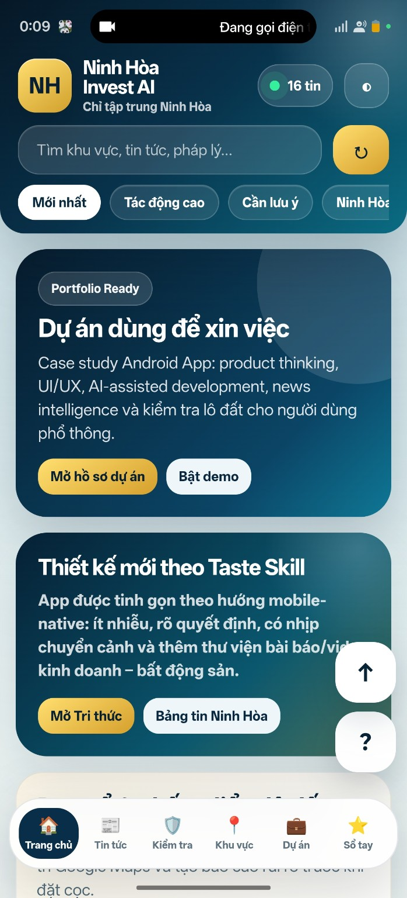
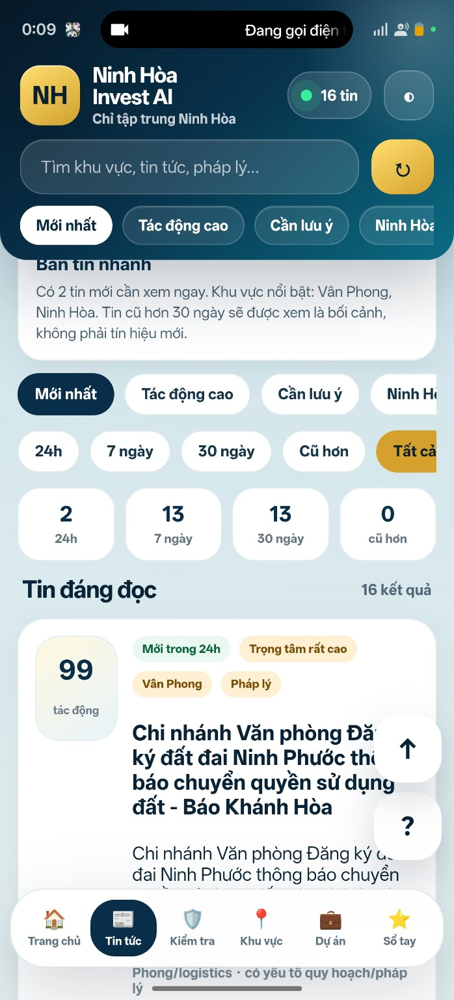
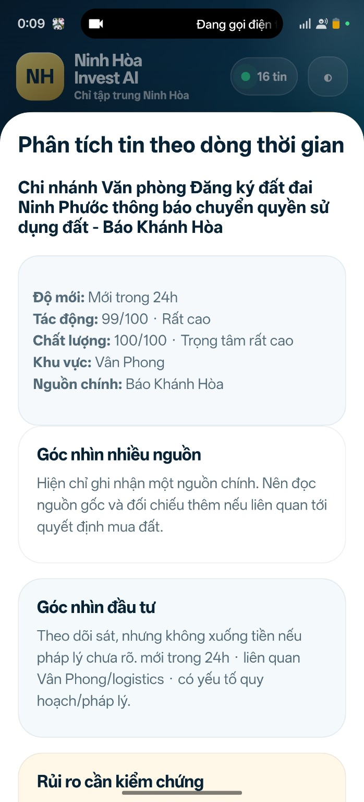
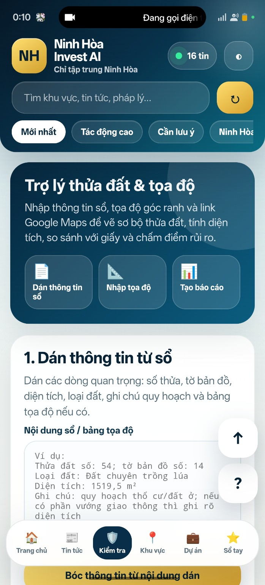
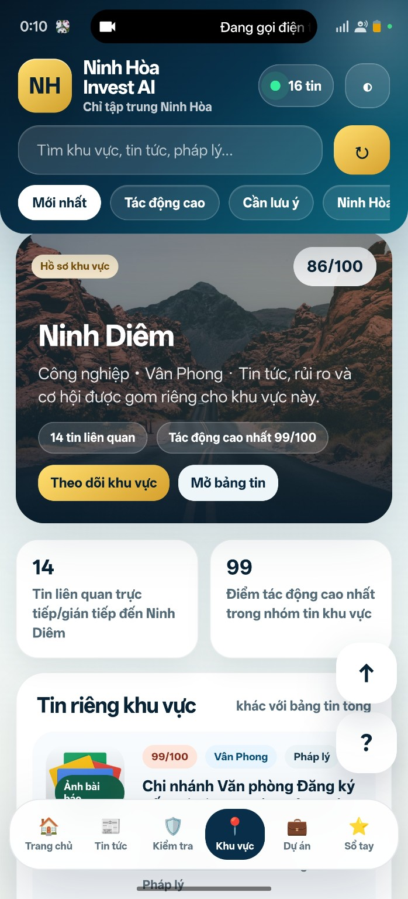
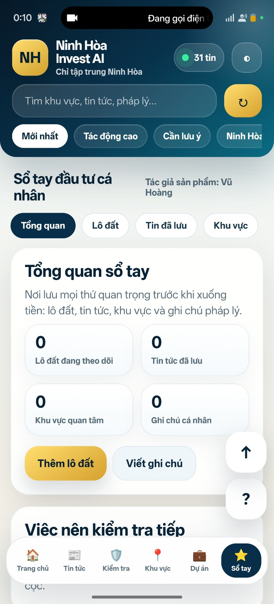

# Ninh Hòa Invest AI V33 — Public Portfolio Edition

<p align="center">
  
  
  
</p>

<p align="center">
  
  
  
</p>

**Ninh Hòa Invest AI** là một Android app portfolio tập trung vào khu vực **Ninh Hòa – Khánh Hòa**, hỗ trợ người dùng theo dõi tin tức bất động sản, phân tích tác động khu vực, kiểm tra sơ bộ lô đất và lưu sổ tay đầu tư cá nhân.

Phiên bản **V33 — Public Portfolio Edition** được tinh chỉnh để đưa lên GitHub, CV, Facebook, LinkedIn và sử dụng trong phỏng vấn việc làm.

> Đây là dự án portfolio/case study. App chỉ hỗ trợ sàng lọc thông tin ban đầu, không thay thế cơ quan nhà nước, luật sư, chuyên gia quy hoạch hoặc đơn vị thẩm định bất động sản.

---

## Project Overview

Ninh Hòa Invest AI xuất phát từ nhu cầu thực tế: người dùng phổ thông khi quan tâm bất động sản thường phải tự đọc tin tức, kiểm tra quy hoạch, pháp lý, vị trí, rủi ro và tiềm năng khu vực từ nhiều nguồn khác nhau.

Ứng dụng tập trung vào việc biến quá trình đó thành một trải nghiệm mobile-first dễ hiểu hơn:

- Gom tin tức liên quan Ninh Hòa/Khu vực lân cận.
- Chấm điểm tác động tin tức theo logic sản phẩm.
- Phân loại tin mới, tin quan trọng, tin cần lưu ý.
- Hỗ trợ đọc nhanh tin theo góc nhìn nhà đầu tư.
- Ghi chú lô đất, khu vực và thông tin cần kiểm chứng.
- Tổ chức sổ tay đầu tư cá nhân ngay trên điện thoại.

---

## Problem

Nhà đầu tư nhỏ lẻ hoặc người lần đầu quan tâm đất tại Ninh Hòa thường gặp các vấn đề:

- Tin tức hạ tầng, quy hoạch, pháp lý nằm rải rác ở nhiều nguồn.
- Khó phân biệt tin mới, tin cũ, tin có tác động cao và tin chỉ mang tính tham khảo.
- Không có nơi lưu lại lô đất, ghi chú, link Google Maps, tin liên quan và trạng thái kiểm tra.
- Dễ bỏ sót các bước kiểm chứng như pháp lý, quy hoạch, giá/m², thanh khoản và rủi ro đặt cọc.
- Người dùng non-tech cần giao diện rõ, ít thao tác, dễ hiểu bằng tiếng Việt.

---

## Solution

Ninh Hòa Invest AI xây dựng một app Android tập trung vào **Real Estate Intelligence** cho khu vực Ninh Hòa.

Ứng dụng không cố gắng thay thế chuyên gia, mà đóng vai trò như một lớp hỗ trợ ban đầu:

- Đọc và phân loại tin tức.
- Tóm tắt tác động theo khu vực.
- Tạo góc nhìn đầu tư sơ bộ.
- Lưu hồ sơ khu vực/lô đất.
- Nhắc người dùng kiểm chứng rủi ro trước khi ra quyết định.

---

## Key Features

### 1. Bảng tin Ninh Hòa

Theo dõi các tin liên quan đến Ninh Hòa, Vân Phong, pháp lý, hạ tầng, quy hoạch và thị trường.

Các bộ lọc chính:

- Mới nhất.
- Tác động cao.
- Cần lưu ý.
- Ninh Hòa.
- 24h / 7 ngày / 30 ngày / cũ hơn.

---

### 2. News Timeline Intelligence

Ứng dụng mô phỏng logic phân tích tin theo dòng thời gian:

- Độ mới.
- Điểm tác động.
- Chất lượng tin.
- Khu vực liên quan.
- Nguồn chính.
- Góc nhìn nhiều nguồn.
- Góc nhìn đầu tư.
- Rủi ro cần kiểm chứng.

---

### 3. Trợ lý thửa đất & tọa độ

Module hỗ trợ người dùng nhập thông tin cơ bản về lô đất:

- Số thửa.
- Tờ bản đồ.
- Diện tích.
- Loại đất.
- Ghi chú quy hoạch.
- Tọa độ góc ranh nếu có.
- Link Google Maps.

Mục tiêu là giúp người dùng tạo bản ghi sơ bộ trước khi đi kiểm tra thực tế.

---

### 4. Hồ sơ khu vực

Module khu vực giúp gom các tín hiệu theo từng địa bàn, ví dụ:

- Ninh Diêm.
- Vân Phong.
- Khu công nghiệp.
- Pháp lý.
- Tin liên quan.
- Điểm tác động cao nhất.

---

### 5. Sổ tay đầu tư cá nhân

Người dùng có thể lưu lại:

- Lô đất đang theo dõi.
- Tin tức đã lưu.
- Khu vực quan tâm.
- Ghi chú pháp lý/cá nhân.
- Việc cần kiểm tra tiếp.

---

### 6. Mobile-first Vietnamese UX

Ứng dụng được thiết kế cho người dùng Việt Nam, ưu tiên:

- Chữ lớn, dễ đọc.
- Card rõ ràng.
- Ít thao tác.
- Điều hướng dưới màn hình.
- Nút lớn, dễ bấm.
- Giao diện giống app mobile thật, không phải website thu nhỏ.

---

## Screenshots

### Trang chủ / Portfolio Hero


### Bảng tin Ninh Hòa


### Phân tích tin theo dòng thời gian


### Trợ lý thửa đất & tọa độ


### Hồ sơ khu vực


### Sổ tay đầu tư cá nhân


---

## Product Thinking Highlights

Dự án thể hiện các năng lực sản phẩm:

- Xác định một ngách rõ ràng: bất động sản Ninh Hòa/Khánh Hòa.
- Thiết kế app theo hành vi người dùng phổ thông.
- Biến tin tức rời rạc thành timeline/intelligence cards.
- Tách rõ vai trò của app: hỗ trợ sàng lọc, không thay thế thẩm định.
- Tối ưu UI/UX theo hướng mobile-native.
- Xây dựng case study có thể trình bày trong CV/phỏng vấn.

---

## Tech Stack

| Công nghệ | Vai trò |
|---|---|
| HTML | Cấu trúc giao diện |
| CSS | Thiết kế UI mobile |
| JavaScript | Logic tương tác |
| Android WebView | Đóng gói thành app Android |
| Gradle | Build Android APK |
| GitHub Actions | Hỗ trợ build workflow |
| LocalStorage | Lưu dữ liệu offline/demo |

---

## APK Demo

Bạn có thể tạo GitHub Release cho APK demo với tên:

```text
Ninh Hòa Invest AI V33 APK Demo
```

Release notes đề xuất:

```text
Offline Android APK demo for Ninh Hòa Invest AI V33 — a real estate intelligence portfolio app focused on Ninh Hòa, Khánh Hòa.
```

---

## Build APK

Nếu project dùng Gradle Android:

```bash
./gradlew assembleDebug
```

APK thường nằm tại:

```text
app/build/outputs/apk/debug/
```

Nếu build bằng GitHub Actions, kiểm tra mục:

```text
.github/workflows/
```

---

## Legal Disclaimer

Ninh Hòa Invest AI chỉ là app hỗ trợ tham khảo và sàng lọc thông tin ban đầu.

Ứng dụng không thay thế:

- Cơ quan nhà nước.
- Văn phòng đăng ký đất đai.
- Luật sư.
- Chuyên gia quy hoạch.
- Đơn vị thẩm định giá.
- Kiểm tra pháp lý trực tiếp.

Người dùng cần xác minh thông tin từ nguồn chính thức trước khi mua bán, đặt cọc hoặc ra quyết định đầu tư.

---

## Limitations

Phiên bản portfolio hiện tại có giới hạn:

- Dữ liệu demo/mô phỏng.
- Chưa tích hợp API tin tức thật.
- Chưa có backend/cloud database.
- Chưa có đăng nhập tài khoản.
- Chưa thay thế được tra cứu pháp lý chính thức.
- Chưa có bản đồ quy hoạch chính thức.

---

## Roadmap

### Public Portfolio Edition

- README có ảnh demo.
- GitHub About + Topics.
- APK Release.
- CV snippet.
- Legal disclaimer rõ ràng.

### Future Commercial Direction

- Tích hợp nguồn tin chính thống.
- Thêm quản lý lô đất nâng cao.
- Đồng bộ cloud.
- Bản đồ/checklist vị trí.
- AI tóm tắt tin tức thật.
- Hệ thống cảnh báo theo khu vực.
- Gói Free/Pro cho người dùng quan tâm BĐS địa phương.

---

## CV Description

```text
Ninh Hòa Invest AI — Android Real Estate Intelligence App

Built an Android portfolio app focused on Ninh Hòa, Khánh Hòa, helping users track real estate news, classify market signals, store investment notes, and perform preliminary land parcel checks.

Designed mobile-first Vietnamese UX for non-tech users, with modules for news timeline intelligence, impact analysis, land scoring, investment notebook, legal checklist, and APK build workflow.

Tech stack: HTML, CSS, JavaScript, Android WebView, Gradle, GitHub Actions, LocalStorage.
```

---

## Author

**Vũ Hoàng**  
AI Solutions Builder / Android App Portfolio

GitHub: [Megatavn](https://github.com/Megatavn)

---

## License

This project is released under the MIT License.
